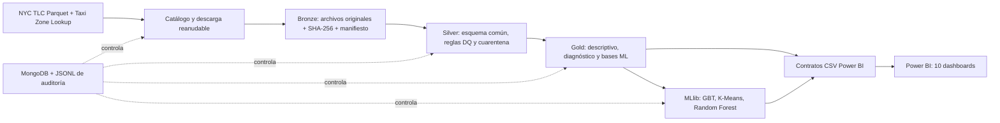

# Examen final Big Data — NYC TLC Trip Record Data

Solución reproducible en **PySpark 3.5 + MongoDB + Power BI** que ingiere y procesa el
100 % de los archivos mensuales publicados por NYC TLC para `yellow`, `green`, `fhv` y
`fhvhv`: los 144 archivos obligatorios de 2023–2025 y, automáticamente, todos los de
2026 que estén publicados el día de la ejecución. No hay muestreo ni límites de filas.

Fuente oficial: <https://www.nyc.gov/site/tlc/about/tlc-trip-record-data.page>

## Cobertura del examen

| Requisito | Implementación / evidencia |
|---|---|
| Arquitectura | Medallion Bronze–Silver–Gold, descrita en `docs/architecture.md` |
| Ingesta | Catálogo oficial, descarga paralela reanudable, idempotencia y SHA-256 |
| Auditoría | MongoDB + respaldo JSONL, manifiesto por archivo, calidad y modelos |
| PySpark/MongoDB | Toda la transformación, agregación y ML usa PySpark; auditoría usa MongoDB |
| 3 descriptivos | Páginas 01–03 del PBIP y tres tablas Gold descriptivas |
| 3 diagnósticos | Páginas 04–06 del PBIP y tres tablas Gold diagnósticas |
| 3 modelos | Serie temporal GBT, K-Means y Random Forest; páginas 07–09 |
| 1 auditoría | Página 10 y contrato `D10_Auditoria.csv` |

El proyecto Power BI nativo está en `powerbi/TLC_BigData.pbip`. Contiene 10 páginas y
60 visuales. Su catálogo está documentado en `docs/dashboard_catalog.md`.
La explicación completa de gráficos, métricas y términos en inglés está disponible en
`docs/GUIA_POWER_BI.md`.

## Arquitectura



## Ejecución completa

Requisitos: Docker Desktop con al menos 8 GB de RAM asignada, Power BI Desktop y
aproximadamente 50 GB libres. Desde PowerShell, en la raíz del repositorio:

```powershell
docker compose build spark
docker compose up -d mongo
docker compose run --rm spark tlc-pipeline catalog
docker compose run --rm spark tlc-pipeline full `
  --catalog-input /workspace/data/bronze/_catalog.json
```

El mismo flujo está empaquetado para el día del examen:

```powershell
.\scripts\run_exam.ps1 -OpenPowerBI
```

`full` ejecuta Bronze → Silver → Gold → modelos → contratos Power BI → verificación.
El snapshot evita volver a enviar 192 comprobaciones HEAD al CDN inmediatamente antes
de descargar; si no se indica, `full` también descubre el catálogo. Si una descarga
se interrumpe, al repetir el comando continúa desde el
archivo `.part`; los archivos ya validados se omiten. Para ejecutar fases por separado:

```powershell
docker compose run --rm spark tlc-pipeline ingest
docker compose run --rm spark tlc-pipeline silver
docker compose run --rm spark tlc-pipeline gold
docker compose run --rm spark tlc-pipeline models
docker compose run --rm spark tlc-pipeline audit-export
docker compose run --rm spark tlc-pipeline powerbi
docker compose run --rm spark tlc-pipeline verify
```

Al no pasar `--years`, el pipeline incluye 2023, 2024, 2025 y descubre 2026 desde la
página oficial. Por eso el mismo comando sirve el día del examen sin editar código.
El catálogo falla de forma explícita si falta cualquiera de los 144 históricos.

## Capas y controles

- **Bronze:** binarios originales particionados por servicio/año/mes, catálogo,
  `Content-Length`, ETag, SHA-256, magic bytes Parquet, sidecar y manifiesto atómico.
- **Silver:** unificación de cuatro esquemas, tipado, derivación temporal, zonas,
  reglas de integridad y partición entre registros válidos y cuarentena. Se exige
  `origen = válidos + cuarentena` por archivo y total.
- **Gold:** nueve bases de análisis y las salidas/metricas de los tres modelos,
  persistidas en Parquet Zstandard. No se duplican íntegramente en CSV: los diez
  contratos Power BI se derivan del 100 % de Gold y son el único serving CSV.
- **Auditoría:** colecciones `pipeline_runs`, `file_manifest`, `quality_results` y
  `model_runs`; respaldo `logs/audit_events.jsonl` y exportación para Power BI.

El diccionario de datos y las reglas están en `docs/data_dictionary.md`.

## Modelos predictivos

- **Serie de tiempo:** Gradient-Boosted Trees con variables calendario y rezagos;
  partición temporal de 90 días, pronóstico recursivo de 30 días y métricas RMSE,
  MAE, R² y MAPE.
- **Segmentación:** K-Means de cuatro clusters de zonas, variables estandarizadas y
  evaluación por silhouette.
- **Clasificación:** Random Forest de 100 árboles para alta demanda (percentil 75),
  partición temporal de 90 días y métricas AUC ROC/PR, accuracy, precision, recall y F1.

Las semillas y parámetros están fijados en `config/pipeline.yaml` para reproducibilidad.

## Power BI

Después de una ejecución satisfactoria, abra `powerbi/TLC_BigData.pbip` y seleccione
**Actualizar**. Las diez tablas apuntan a `exports/powerbi/*.csv`; el pipeline genera
esos contratos desde el universo procesado. Los placeholders estructurales contienen
`status=PLACEHOLDER` y hacen fallar deliberadamente la verificación final.

## Verificación

```powershell
docker compose run --rm -e PYTHONDONTWRITEBYTECODE=1 spark `
  sh -lc "ruff check src tests scripts && pytest -q"
docker compose run --rm spark tlc-pipeline verify
```

La verificación integral comprueba alcance histórico, checksums/sidecars, manifiesto,
reconciliación de filas, tablas Gold, artefactos y métricas ML, eventos de auditoría,
los diez contratos productivos y la estructura PBIP. Consulte
`docs/exam_checklist.md` para la evidencia de entrega.
El resultado queda persistido en `exports/verification_report.json`.

## Estructura principal

```text
config/                 configuración única del pipeline
src/tlc_pipeline/       catálogo, ingesta, auditoría, ETL, Gold, ML y verificación
tests/                  pruebas unitarias e integración Spark
data/bronze|silver|gold datos por capa (ignorados por Git)
artifacts/models/       modelos Spark ML persistidos
exports/powerbi/        contratos consumidos por Power BI
powerbi/                proyecto PBIP/PBIR versionable
docs/                   arquitectura, diccionario, dashboards y checklist
```
